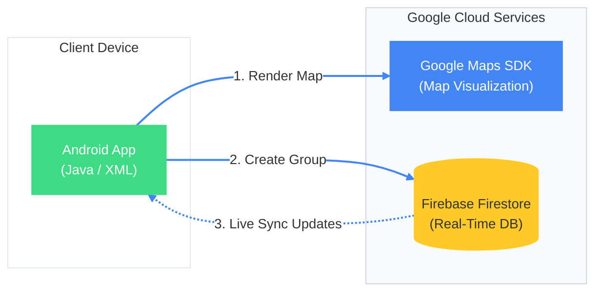

# StudyBuds 📍
### *Real-Time Campus Study Group Finder*

   

**StudyBuds** is a centralized platform designed to connect college freshmen with classmates to form spontaneous study groups. Built in just 24 hours at **DubHacks 2024**, the native Android application utilizes **Google Maps** and **Firebase** to provide a real-time view of where students are studying on campus, eliminating the isolation of studying alone.

---

## 🏗️ System Architecture

---
## 🚀 Key Features

* **Interactive Campus Map:** integrated **Google Maps API** to display pins for active study groups nearby. Clicking a pin reveals the specific course (e.g., *"CSE 142"*) and location.
* **Real-Time Feed:** Powered by **Firebase Firestore**, the study groups list updates instantly. As soon as a student creates a group in the library, it appears on everyone else's feed without needing to refresh.
* **Group Management:** Users can browse detailed listings—including class name, exact location, and group size—and join with a single click or broadcast their own study session to the campus.

---

## 🛠️ Tech Stack

| Component | Technology | Role |
| :--- | :--- | :--- |
| **Database** | Firebase Firestore | Enabled real-time cloud syncing so students see new groups instantly. |
| **Maps** | Google Maps API | Provided the geolocation interface for visualizing study groups on the campus map. |
| **Context** | DubHacks 2024 | Built by a team of 3 in a 24-hour hackathon environment. |

---

## 📱 Interface Preview

  
  
  
  
  

